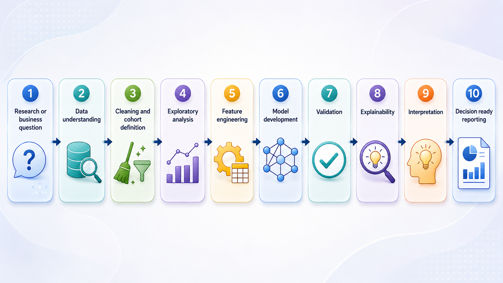

<div align="center">
<br>
<strong><big>Healthcare Data Scientist and Analyst</big></strong><br><br>
<strong>Turning complex health data into clear, reproducible and clinically meaningful evidence</strong><br><br>

[](#technical-toolkit)
[](#technical-toolkit)
[](#selected-project-case-studies)
[](#technical-toolkit)
[](#contact)

<p align="center">
  <a href="https://mahreenkiran.github.io/Portfolio/"><strong>View the interactive portfolio</strong></a>
  &nbsp;&nbsp; | &nbsp;&nbsp;
  <a href="Mahreen_Kiran_Healthcare_Data_Portfolio.pdf"><strong>Download the PDF portfolio</strong></a>
  &nbsp;&nbsp; | &nbsp;&nbsp;
  <a href="https://linkedin.com/in/mahreen-kiran"><strong>LinkedIn</strong></a>
  &nbsp;&nbsp; | &nbsp;&nbsp;
  <a href="mailto:mehreen.kiran89@gmail.com"><strong>Email</strong></a>
</p>

</div>

<br clear="left">

---

<div align="justify">
     
## About this portfolio

This repository contains my professional portfolio in **healthcare data science, machine learning, clinical prediction, public health analytics, explainable AI and evidence synthesis**.

It is designed for recruiters, healthcare analytics teams, research groups and collaborators who want to quickly understand:

- The types of data problems I work on
- The methods and tools I use
- The projects I have delivered
- The value of my work for healthcare, public health and research decision-making

The full visual case studies are available in the [interactive portfolio website](https://mahreenkiran.github.io/Portfolio/).


## Portfolio at a glance

| Area | Evidence shown |
|---|---|
| **Healthcare data science** | Type 2 diabetes prediction, dengue infection prediction, water-quality safety analysis and healthcare AI evidence synthesis |
| **Population health analytics** | Large-scale Type 2 diabetes prediction using UK Biobank data |
| **Data preparation and quality control** | Cohort definition, missing-data checks, feature engineering, recoding, outlier assessment and analysis-ready dataset creation |
| **Predictive modelling** | Survival analysis, classification, neural networks, ensemble learning and risk stratification |
| **Model validation** | Cross-validation, sensitivity analysis, ablation analysis, temporal checks and geographic validation |
| **Model interpretation and responsible AI** | SHAP, feature importance, sensitivity analysis, causal reasoning and clear reporting of limitations |
| **Public health analytics** | Dengue infection prediction, Tuberculosis  and drinking-water safety analysis using clinical, epidemiological, environmental and monitoring data |
| **Evidence synthesis** | Bibliometric analysis, thematic analysis and literature mapping of healthcare AI research |
| **Communication** | Employer-focused case studies, visual summaries, publication outputs and decision-ready reporting |
| **Technical toolkit** | Advanced Python, advanced SQL, R, scikit-learn, XGBoost, SHAP, Power BI, VOSviewer, Bibliometrix and Excel |

## Technical toolkit

| Area | Tools and methods |
|---|---|
| **Languages** | Advanced Python, Advanced SQL, Basic R |
| **Data analysis** | pandas, NumPy, Excel and Jupyter Notebook |
| **Machine learning** | scikit-learn, XGBoost, Random Forest, Gradient Boosting, Logistic Regression and neural networks |
| **Survival analysis** | Cox proportional hazards models, risk trajectories and Kaplan-Meier analysis |
| **Deep learning** | TensorFlow and PyTorch |
| **Explainability** | SHAP, feature importance, permutation importance, ablation analysis, sensitivity analysis and model interpretation |
| **Causal methods** | Directed acyclic graphs, matching, adjusted modelling and intervention reasoning |
| **Visualisation** | Matplotlib, Seaborn, Power BI and portfolio visual reporting |
| **Research analytics** | Bibliometrix, Biblioshiny, VOSviewer, Web of Science and Scopus |
| **Validation** | Cross-validation, temporal validation, geographic validation, calibration and robustness checks |

---

<div align="justify">
     
## Evidence of analytical capability

This section summarises the strongest evidence from my portfolio and shows how each project demonstrates skills relevant to healthcare data science, clinical analytics, population health and AI research roles.

| Portfolio evidence | What it demonstrates |
|---|---|
| **19,000+ UK Biobank participants analysed** | Experience working with large-scale population health data, cohort development and predictive analytics |
| **0.90 C-index in Type 2 diabetes prediction** | Strong capability in time-to-event modelling, survival analysis and risk stratification |
| **1,800 neural networks trained** | Robust repeated modelling, validation and behavioural systems analysis |
| **3,000+ dengue patient records across five districts** | Public health analytics using clinical, serological, epidemiological and environmental variables |
| **3,581 drinking-water samples analysed** | Environmental health analytics, data cleaning, guideline auditing and contamination-pattern detection |
| **2,351 articles mapped over 33 years** | Bibliometric analysis, thematic analysis, research intelligence and evidence synthesis |
| **Multiple explainability methods used** | SHAP, feature importance, ablation analysis and responsible interpretation of model outputs |

---
</div>

## Selected Projects

This section presents six selected projects from my wider portfolio. They were chosen to demonstrate my experience across healthcare data science, machine learning, public health analytics, explainable AI, survival analysis and evidence synthesis.

### 1. Behaviour-aware Digital Twin for Type 2 diabetes prediction

**Question:** Can behavioural, lifestyle and psychosocial variables help predict the onset of Type 2 diabetes without relying only on laboratory biomarkers?

**Methods:** Cox survival analysis, risk stratification, validation, causal reasoning, Digital Twin simulation and interpretable modelling.

**Key result:** The survival model achieved a **0.90 C-index**, showing strong discrimination for time-to-diabetes onset.

**Value:** Demonstrates population health analytics, longitudinal modelling, prevention-focused interpretation and the ability to translate risk models into practical health insight.

---

### 2. Neural framework for behavioural network reorganisation

**Question:** How do sleep, diet, smoking, BMI and psychosocial wellbeing interact differently in healthy and Type 2 diabetes populations?

**Methods:** Neural networks, repeated five-fold cross-validation, connection-weight analysis, behavioural network analysis and centrality interpretation.

**Key result:** The analysis showed that healthy links between sleep, diet and emotional wellbeing were weaker in people with Type 2 diabetes.

**Value:** Demonstrates the ability to convert complex neural-network outputs into understandable behavioural patterns.

---

### 3. Climate-sensitive machine learning for dengue infection prediction

**Question:** Can clinical, laboratory, serological, behavioural, epidemiological and environmental variables support dengue infection prediction?

**Methods:** Logistic Regression, Random Forest, Gradient Boosting, Decision Tree, SMOTE, cross-validation, feature importance and ablation analysis.

**Key result:** Initial model comparisons produced **AUC-ROC values around 0.90 to 0.94**. Sensitivity analysis showed that diagnostic serology strongly influenced full-model performance.

**Value:** Demonstrates strong analytical judgement by separating model performance from possible diagnostic leakage.

---

### 4. Machine-learning audit of drinking-water safety

**Question:** Can machine learning and guideline-based analysis identify contamination patterns in drinking-water monitoring data?

**Methods:** Data cleaning, WHO guideline auditing, XGBoost, SHAP, K-means clustering, PCA and trend analysis.

**Key result:** The analysis identified geographic water-quality signatures, contamination regimes and widespread guideline exceedance patterns.

**Value:** Demonstrates environmental health analytics, unsupervised learning and public-health focused interpretation.

---

### 5. Bibliometric and thematic analysis of AI in Type 2 diabetes prediction

**Question:** How has AI and machine learning research for Type 2 diabetes prediction evolved over time?

**Methods:** PRISMA-guided literature dataset preparation, Bibliometrix, Biblioshiny, VOSviewer, citation analysis, collaboration mapping and thematic analysis.

**Key result:** The analysis mapped **33 years of research** and included **2,351 articles** from Web of Science and Scopus.

**Value:** Demonstrates research intelligence, evidence synthesis and the ability to identify methodological trends and clinical translation gaps.

---

### 6. Explainable AI for climate-dependent treatment effectiveness

**Question:** How do climate variables such as temperature, humidity and precipitation influence treatment effectiveness?

**Methods:** XGBoost, SHAP interaction analysis, Monte Carlo simulation and multimodal evidence integration.

**Key result:** The analysis identified climate-response patterns and showed how environmental conditions can alter treatment effectiveness.

**Value:** Demonstrates transferable skills in interaction analysis, simulation, uncertainty and explainable AI.

---


## How I work

My analytical workflow is structured around reproducibility, interpretability and decision relevance.



I focus on making sure that the model answers the right question, uses appropriate data, avoids misleading performance claims and produces findings that can be understood by clinical, public health, research and operational audiences.

---

## Publications and research communication

Selected publications and evidence outputs are included in the portfolio website. They demonstrate experience in research design, analytical reporting, peer-reviewed writing and communication of complex methods to academic and professional audiences.

[View full publication list on Google Scholar](https://scholar.google.com/citations?hl=en&user=dJA-TzEAAAAJ&view_op=list_works)

---

<!-- ## Repository structure

```text
Portfolio/
│
├── README.md
├── index.html
├── .nojekyll
└── assets/
    ├── profile.jpeg
    ├── name.svg
    ├── project visuals
    ├── model outputs
    └── portfolio images
```

---
-->

## How to view the portfolio

### Interactive website

Open the live portfolio:

[https://mahreenkiran.github.io/Portfolio/](https://mahreenkiran.github.io/Portfolio/)

### Local version

Download the repository and open:

```text
index.html
```

> Note: I recommend using the interactive website as the main portfolio view. A PDF export can be added later once the print layout is fully polished.

---

## Target roles

I am interested in roles where I can apply data science, healthcare analytics and machine learning to real-world health and research problems.

| Role areas |
|---|
| Healthcare Data Analyst |
| Senior Data Analyst |
| Clinical Data Analyst |
| Population Health Analyst |
| Health Data Scientist |
| Healthcare AI Researcher |
| Public Health Data Analyst |
| Research Data Scientist |

---

## Contact

**Dr Mahreen Kiran**  
Portsmouth, United Kingdom  
Global Talent Visa, no sponsorship required  

**Email:** [mehreen.kiran89@gmail.com](mailto:mehreen.kiran89@gmail.com)  
**LinkedIn:** [linkedin.com/in/mahreen-kiran](https://linkedin.com/in/mahreen-kiran)  
**Portfolio:** [mahreenkiran.github.io/Portfolio](https://mahreenkiran.github.io/Portfolio/)

---
</div>

<div align="center">

### Data becomes valuable when it is transformed into evidence people can trust and use.

</div>
